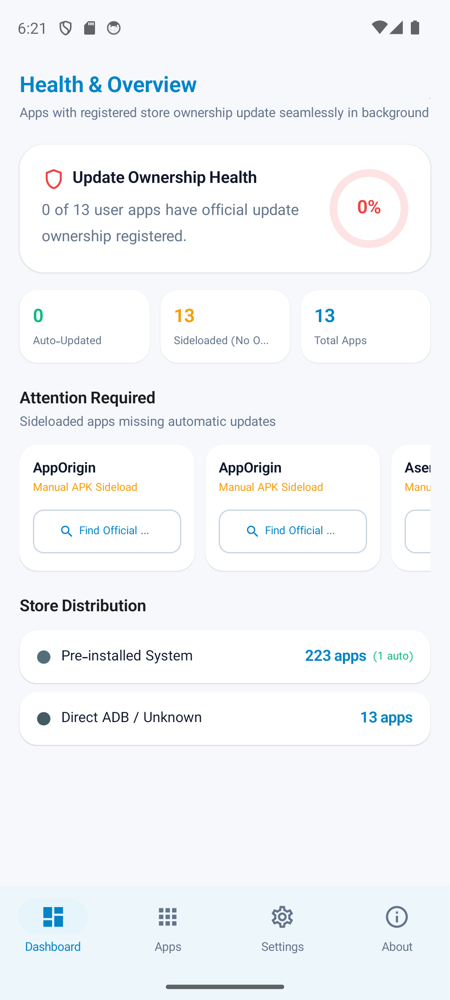
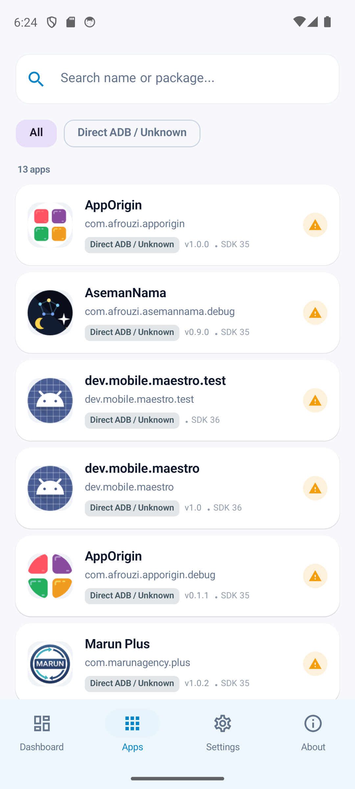
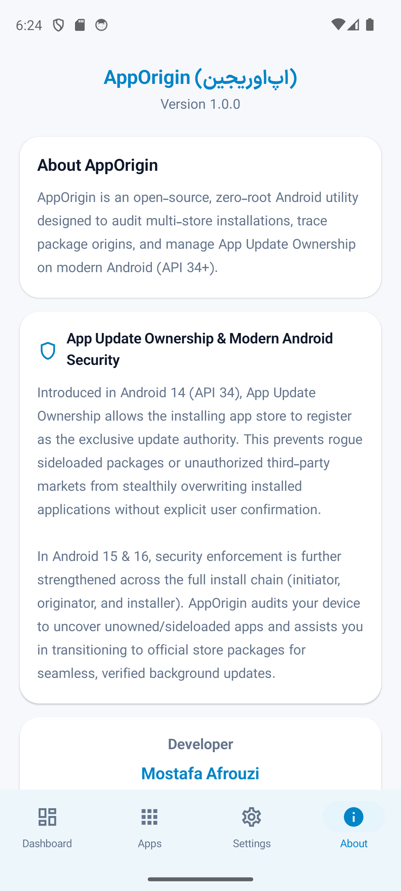
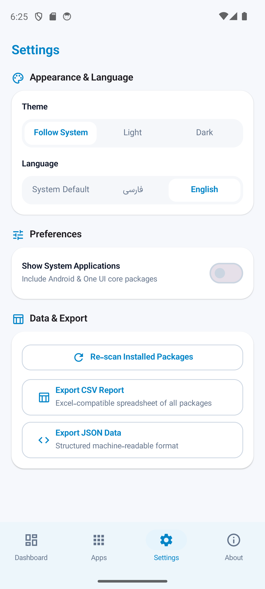

# AppOrigin

[فارسی](README.md) · **English**

A native, zero-root, open-source Android utility to audit multi-store package installation origins and inspect **App Update Ownership** on Android 14, 15, and 16.

<div dir="ltr">

[](https://github.com/mostafaafrouzi/app-origin-android/releases)
[](https://android-arsenal.com/api?level=26)
[](https://kotlinlang.org)
[](https://developer.android.com/jetpack/compose)
[](https://github.com/mostafaafrouzi/app-origin-android)
[](LICENSE)

</div>

---

## Screenshots

| Health & Overview | Package Directory & Stores | Audit Sheet & Ownership |
| :---: | :---: | :---: |
|  |  |  |

| About & Security Insights | Preferences & Data Export |
| :---: | :---: |
|  |  |

---

## The Problem: Store Fragmentation in Modern Android

In today's Android ecosystem, users install applications across various sources:
* **Google Play Store:** Primary source for global apps and system services.
* **Open-Source Stores (F-Droid & Aurora Store):** Privacy-conscious and FOSS repositories.
* **OEM Stores (e.g., Samsung Galaxy Store, Huawei AppGallery, Xiaomi GetApps):** Manufacturer utilities and system components.
* **Regional & Local Stores (Cafe Bazaar, Myket):** Banking, fintech, and local services.
* **Direct Sideloaded APKs (Telegram, Web, GitHub):** Developer previews, beta APKs, and custom tools.

### The Breaking Change in Android 14+ (App Update Ownership)
Android 14 (API 34) introduced the **App Update Ownership** mechanism (`InstallSourceInfo.getUpdateOwnerPackageName()`):
1. **Unattended Silent Updates:** When an app is installed from Store A, Store A registers as the exclusive update owner and can seamlessly update the app in the background without prompting the user.
2. **Ownership Conflicts:** If Store B attempts to update the app, Android blocks the silent update and prompts an ownership conflict warning dialog.
3. **Orphaned Sideloaded APKs:** Apps installed manually via direct APKs have no registered update owner. They sit orphaned on the phone, never receiving automatic security updates.

**AppOrigin** audits these packages, traces their installers, and gives you transparent visibility into your device's package provenance.

---

## Key Features

### 1. Comprehensive Global & Regional Store Support
* Traces install source, initiating package, and update owner across global and regional stores: Google Play, F-Droid, Aurora Store, Galaxy Store, Amazon Appstore, Cafe Bazaar, Myket, and direct APK sideloads.
* **Dynamic Third-Party Recognition:** Custom package installers and emerging markets are automatically recognized as distinct standalone stores.

### 2. Update Ownership Health Index
* Real-time calculation of officially managed packages versus sideloaded packages lacking automatic update owners.
* Dedicated system app filter to audit pre-installed OS packages independently.

### 3. Smart Store Search Picker
* Seamlessly redirects to the original marketplace or suggests installed alternative stores for fast resolution.

### 4. Streamlined & Responsive App Cards
* Minimalist layout showcasing package names, versions, store badges, and Target SDK indicators without awkward text wrapping.

### 5. Asynchronous Data Export with Progress Dialog
* Export complete installed package audits to **CSV (Excel-compatible)** or structured **JSON**.
* Runs in background coroutines with zero UI stutters, accompanied by a progress dialog and instant cancellation support.
* Utilizes standard Android `FileProvider` to share files without IPC memory limitations.

### 6. Calibrated Adaptive Icon & Refined Typography
* Pixel-perfect adaptive launcher icon compliant with Samsung One UI Squircle and Pixel Circle masks.
* Authentic Persian typography powered by IRANSansX with native Persian digits, paired with standard Latin numerals in English.

---

## Technical Architecture

Built using modern Android standards, **Clean Architecture**, and **Jetpack Compose**:

```
app/src/main/java/com/afrouzi/apporigin/
├── AppOriginApplication.kt          # Application class & dynamic locale management
├── data/
│   ├── model/                      # Data models: AppItem, StoreType, AuditSummary
│   ├── catalog/                    # StoreCatalog, deep links & search intent registry
│   ├── source/                     # PackageManagerDataSource & InstallSourceInfoResolver
│   ├── prefs/                      # DataStore SettingsRepository & AppSettings
│   ├── export/                     # Asynchronous CSV and JSON report exporter
│   └── repository/                 # PackageRepositoryImpl with memory caching
├── domain/
│   ├── repository/                 # PackageRepository interface
│   └── usecase/                    # Scan, filter, and sort use cases
└── ui/
    ├── theme/                      # Typography Fonts.kt, Color.kt & AppOriginTheme
    ├── navigation/                 # NavigationItem enum & bottom bar tabs
    ├── components/                 # AppCardItem, AppDetailSheet, ProgressDialog
    ├── dashboard/                  # Dashboard & animated health chart
    ├── apps/                       # App directory with dynamic store chips
    ├── settings/                   # Appearance, system apps toggle & data export
    └── about/                      # About screen with Android 14+ technical insights
```

---

## Build & Run

### Prerequisites
* **Android Studio Ladybug (or newer)**
* **JDK 17**
* Android device or emulator running Android 8.0 (API 26) or higher

### Build Commands
```bash
# Clone the repository
git clone https://github.com/mostafaafrouzi/app-origin-android.git
cd app-origin-android

# Build Cafe Bazaar variant
./gradlew assembleBazaarDebug

# Or build Myket variant
./gradlew assembleMyketDebug
```

---

## Marketplace Variants (Flavors)

* **Cafe Bazaar (`bazaar`):** Integrates the Cafe Bazaar developer profile link.
* **Myket (`myket`):** Integrates the Myket developer profile link.

---

## Privacy & Security

* **Permission:** `<uses-permission android:name="android.permission.QUERY_ALL_PACKAGES" />`
  * Strictly used locally to inspect package origin and audit update ownership.
* **Zero Network Traffic:** AppOrigin requires zero internet permissions. All auditing and processing happen 100% on-device.
* **Ad-Free & Telemetry-Free:** No analytics, trackers, or background telemetry.

---

## Developer

Built with passion by **Mostafa Afrouzi**:
* 🌐 **Website (Persian):** [afrouzi.ir](https://afrouzi.ir/?utm_source=apporigin&utm_medium=github_readme&utm_campaign=apporigin)
* 🌐 **Website (English):** [afrouzi.ir/en](https://afrouzi.ir/en/?utm_source=apporigin&utm_medium=github_readme&utm_campaign=apporigin)
* 🐙 **GitHub:** [github.com/mostafaafrouzi](https://github.com/mostafaafrouzi)
* 💼 **LinkedIn:** [linkedin.com/in/mostafaafrouzi](https://linkedin.com/in/mostafaafrouzi)
* 🛍️ **Cafe Bazaar:** [Developer Apps on Cafe Bazaar](https://cafebazaar.ir/developer/057657612999)
* 🛒 **Myket:** [Developer Apps on Myket](https://myket.ir/developer/dev-102174)

---

## License

This project is licensed under the [MIT License](LICENSE).
