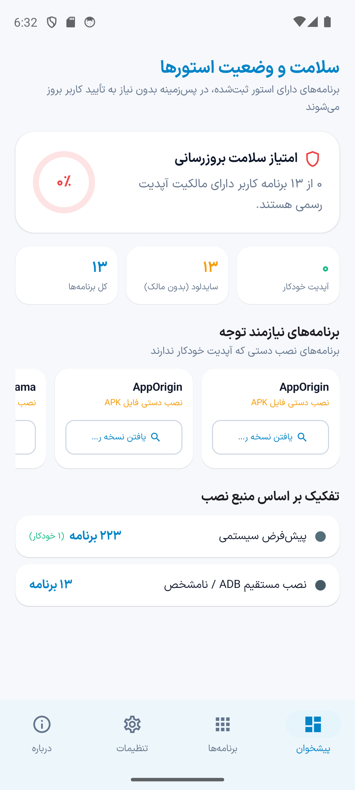
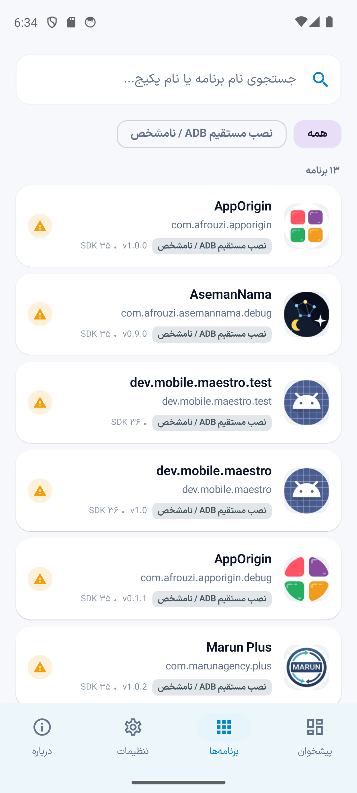
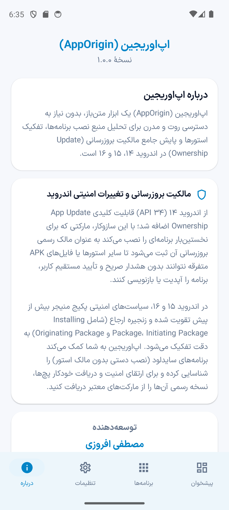
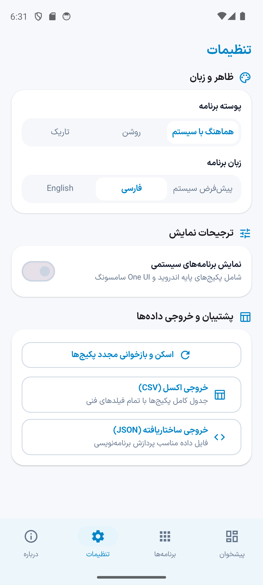

# اپ‌اوریجین (AppOrigin)

**فارسی** · [English](README.en.md)

اپلیکیشن نیتیو، مدرن و متن‌باز اندروید برای ردیابی منبع نصب برنامه‌ها، تفکیک مارکت‌ها و پایش مالکیت به‌روزرسانی (**App Update Ownership**) در اندروید ۱۴، ۱۵ و ۱۶، **کاملاً بدون نیاز به روت (Zero-Root)**.

<div dir="ltr">

[](https://github.com/mostafaafrouzi/app-origin-android/releases)
[](https://android-arsenal.com/api?level=26)
[](https://kotlinlang.org)
[](https://developer.android.com/jetpack/compose)
[](https://github.com/mostafaafrouzi/app-origin-android)
[](LICENSE)

</div>

---

## نماهایی از محیط برنامه

| پیشخوان و سنجش سلامت | لیست برنامه‌ها و استورها | جزئیات فنی و پایش مالکیت |
| :---: | :---: | :---: |
|  |  |  |

| درباره و تحلیل‌های امنیتی | تنظیمات و خروجی داده‌ها |
| :---: | :---: |
|  |  |

---

## صورت مسئله و فلسفهٔ وجودی

در گوشی‌های اندرویدی، کاربران برنامه‌های خود را از منابع گوناگونی نصب می‌کنند:
* **گوگل پلی استور (Google Play):** منبع اصلی اپلیکیشن‌های بین‌المللی و ابزارهای سیستم.
* **استورهای متن‌باز (F-Droid و Aurora Store):** مخازن اپلیکیشن‌های آزاد و متمرکز بر حریم خصوصی.
* **استورهای سازندگان دستگاه (OEMs):** گلکسی استور سامسونگ، گت‌اپس شیائومی، اپ‌گالری هواوی.
* **استورهای ایرانی و منطقه‌ای (کافه بازار و مایکت):** برای برنامه‌های بانکی، بومی و خدماتی.
* **نصب مستقیم فایل APK (سایدلود، تلگرام، گیت‌هاب):** ابزارهای تخصصی، نسخه‌های بتا و فایل‌های دریافت شده.

### تغییر مهم در اندروید ۱۴ به بعد (App Update Ownership)
سیستم‌عامل اندروید از نسخهٔ ۱۴ (API 34) سازوکار مالکیت انحصاری به‌روزرسانی (`InstallSourceInfo.getUpdateOwnerPackageName()`) را فعال کرد:
1. **به‌روزرسانی خودکار بدون تأیید مکرر (Silent Updates):** تنها استوری که رسماً مالکیت به‌روزرسانی برنامه را در دست دارد اجازه دارد آپدیت‌ها را در پس‌زمینه نصب کند.
2. **تداخل مالکیت بین مارکت‌ها:** اگر کاربری برنامه‌ای را از یک استور نصب کرده باشد و استور دیگری قصد آپدیت آن را داشته باشد، سیستم‌عامل فرآیند را مسدود می‌کند.
3. **برنامه‌های سرگردان (Sideloaded Apps):** برنامه‌هایی که با فایل مستقیم APK نصب می‌شوند فاقد استور ثبت‌شده هستند و هیچ به‌روزرسانی خودکاری دریافت نمی‌کنند.

**اپ‌اوریجین (AppOrigin)** ساخته شده تا وضعیت دقیق منبع نصب و مالکیت به‌روزرسانی هر برنامه را به شکلی شفاف و روان به شما نشان دهد.

---

## امکانات کلیدی

### ۱. تفکیک دقیق منبع نصب و مارکت مبدأ
* شناسایی استور نصب‌کننده (Installing Package) و استور آغازگر نصب (Initiating Package).
* پوشش فراگیر استورهای بین‌المللی و بومی شامل گوگل پلی، اف‌دروید، آورورا استور، گلکسی استور، کافه بازار، مایکت و نصب مستقیم فایل APK.

### ۲. پایش سلامت و شاخص مالکیت به‌روزرسانی
* محاسبهٔ درصد و تعداد برنامه‌های دارای مالکیت رسمی در برابر برنامه‌های نصب دستی.
* فیلتر هوشمند برنامه‌های پیش‌فرض سیستمی و امکان مشاهدهٔ مستقل پکیج‌های سیستم‌عامل.

### ۳. انتخابگر هوشمند جستجو در استورها (Smart Store Search Picker)
* امکان هدایت مستقیم به صفحهٔ دانلود برنامه در استور مبدأ یا جستجوی سریع در مارکت‌های جایگزین.

### ۴. طراحی کارت‌های یکپارچه و خوانا
* چیدمان مینیمال و غنی اطلاعات شامل نام پکیج، نسخه، شناسهٔ مارکت و نشان نسخهٔ هدف Target SDK بدون شلوغی و شکستگی سطرها.

### ۵. خروجی اکسل (CSV) و JSON غیرهمگام با پنجرهٔ پیشرفت
* اجرای فرآیند خروجی در پس‌زمینه بدون کوچک‌ترین توقف یا هنگ در رابط کاربری.
* پنجرهٔ پیشرفت شیک همراه با درصد زنده و دکمهٔ لغو فوری پردازش.
* اشتراک‌گذاری از طریق FileProvider استاندارد بدون محدودیت حافظهٔ موقت سیستم.

### ۶. تایپوگرافی اصیل و آیکون انطباقی استاندارد
* بهره‌مندی از قلم خوش‌خوان ایران‌سنس ایکس همراه با ارقام فارسی در زبان فارسی و ارقام استاندارد در زبان انگلیسی.
* آیکون انطباقی (Adaptive Icon) کالیبره‌شده با حاشیهٔ امن و چشم‌نواز روی لانچرهای مختلف از جمله One UI سامسونگ و Pixel.

---

## معماری و ساختار فنی

این پروژه با تکیه بر اصول **Clean Architecture** و معماری مدرن **Jetpack Compose** پیاده‌سازی شده است:

```
app/src/main/java/com/afrouzi/apporigin/
├── AppOriginApplication.kt          # راه‌اندازی سراسری و مدیریت زبان
├── data/
│   ├── model/                      # مدل‌های داده AppItem، StoreType، AuditSummary
│   ├── catalog/                    # کاتالوگ جامع استورها، الگوهای Deep Link و وب
│   ├── source/                     # رابط PackageManager و تحلیل‌گر InstallSourceInfo
│   ├── prefs/                      # ذخیره‌سازی ترجیحات با DataStore Preferences
│   ├── export/                     # موتور تولید گزارش‌های اکسل (CSV) و JSON
│   └── repository/                 # پیاده‌سازی مخزن پکیج‌ها با کش حافظه
├── domain/
│   ├── repository/                 # اینترفیس PackageRepository
│   └── usecase/                    # منطق تجاری اسکن، فیلتر ترکیبی و مرتب‌سازی
└── ui/
    ├── theme/                      # تایپوگرافی Fonts.kt، رنگ‌ها و AppOriginTheme
    ├── navigation/                 # تعریف تب‌های NavigationItem
    ├── components/                 # کامپوننت‌های AppCardItem، AppDetailSheet، ProgressDialog
    ├── dashboard/                  # صفحه پیشخوان و دونات چارت سلامت
    ├── apps/                       # لیست برنامه‌ها با فیلترهای پویا
    ├── settings/                   # تنظیمات پوسته، زبان، برنامه‌های سیستمی و استخراج داده
    └── about/                      # صفحه درباره با تحلیل‌های امنیتی اندروید و لینک‌های استور
```

---

## کامپایل و اجرای پروژه (Build & Run)

### پیش‌نیازها
* **Android Studio Ladybug (یا نسخهٔ جدیدتر)**
* **JDK 17**
* دستگاه یا شبیه‌ساز با اندروید ۸.۰ (API 26) به بالا

### مراحل ساخت و اجرا
```bash
# کلون کردن ریپازیتوری
git clone https://github.com/mostafaafrouzi/app-origin-android.git
cd app-origin-android

# ساخت نسخه کافه بازار
./gradlew assembleBazaarDebug

# یا ساخت نسخه مایکت
./gradlew assembleMyketDebug
```

---

## انتشارهای مستقل مارکت‌ها (Flavors)

پروژه به دو طعم اختصاصی مجهز است:
* **نسخهٔ کافه بازار (bazaar):** شامل لینک رسمی صفحهٔ توسعه‌دهنده در کافه بازار.
* **نسخهٔ مایکت (myket):** شامل لینک رسمی صفحهٔ برنامه‌ها در مایکت.

---

## حریم خصوصی و امنیت

* **مجوز دسترسی:** `<uses-permission android:name="android.permission.QUERY_ALL_PACKAGES" />`
  * این مجوز منحصراً برای بررسی بسته و منبع نصب برنامه‌های موجود در دستگاه استفاده می‌شود.
* **کاملاً آفلاین و بدون دسترسی اینترنت:** اپلیکیشن هیچ مجوزی برای اتصال به اینترنت ندارد و هیچ اطلاعاتی از دستگاه خارج نمی‌شود.
* **بدون تبلیغات، بدون رهگیری و بدون جمع‌آوری اطلاعات شخصی.**

---

## توسعه‌دهنده و راه‌های ارتباطی

توسعه داده شده توسط **مصطفی افروزی (Mostafa Afrouzi)**:
* 🌐 **وب‌سایت شخصی (فارسی):** [afrouzi.ir](https://afrouzi.ir/?utm_source=apporigin&utm_medium=github_readme&utm_campaign=apporigin)
* 🌐 **وب‌سایت شخصی (انگلیسی):** [afrouzi.ir/en](https://afrouzi.ir/en/?utm_source=apporigin&utm_medium=github_readme&utm_campaign=apporigin)
* 🐙 **گیت‌هاب:** [github.com/mostafaafrouzi](https://github.com/mostafaafrouzi)
* 💼 **لینکدین:** [linkedin.com/in/mostafaafrouzi](https://linkedin.com/in/mostafaafrouzi)
* 🛍️ **کافه بازار:** [صفحهٔ برنامه‌ها در کافه بازار](https://cafebazaar.ir/developer/057657612999)
* 🛒 **مایکت:** [صفحهٔ برنامه‌ها در مایکت](https://myket.ir/developer/dev-102174)

---

## لایسنس

این پروژه تحت مجوز [MIT License](LICENSE) منتشر شده است.
